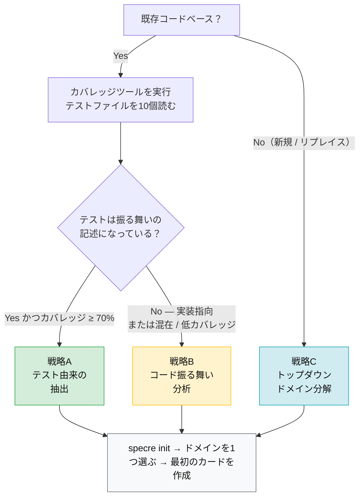

# 導入戦略ガイド

既存コードベースに specre を後付けするエンジニア向けのガイダンスです。新規プロジェクトを始める場合はよりシンプルです：[sdd-new ワークフロー](../../.claude/commands/sdd-new.md)を使って開発と同時に specre カードを作成してください。本ガイドは、蓄積されたコード、テスト、暗黙の設計判断を持つ生きたコードベースに specre を導入するという、より困難な問題に対処します。

## クイック判断チャート



| 戦略 | 使用場面 | 起点 |
|------|---------|------|
| [**戦略A**: テスト由来の抽出](#戦略a-テスト由来の抽出) | 高カバレッジ + 振る舞い指向のテスト | テストスイート |
| [**戦略B**: コード振る舞い分析](#戦略b-コード振る舞い分析) | 低カバレッジ、実装指向、またはテストが混在 | ソースコード |
| [**戦略C**: トップダウンドメイン分解](#戦略c-トップダウンドメイン分解) | 新規、大規模リライト、または解きほぐせないコードベース | ドメイン知識 |

> **迷ったら？** 末尾の[エントリーポイントの選び方](#エントリーポイントの選び方)にジャンプしてください。

---

## フェーズ0: テスト品質の評価

戦略を選ぶ前に、テスト全体の2つの直交する次元を評価します。これにより、仕様抽出の起点として信頼できる成果物が決まります。

### 次元1: カバレッジの広さ

自動テストのカバレッジは何パーセントですか？カバレッジツール（`coverage`、`simplecov`、`istanbul`、`tarpaulin` など）を実行し、数値を記録します。品質に関わらず、コードベースのどの程度の割合で「何らかの」観測をしているかを示します。

### 次元2: テストの意図

これがより重要な軸です。異なるモジュールから10〜20のテストファイルをサンプリングし、それぞれを分類します：

**振る舞い指向のテスト**は「ユーザーが観測可能な結果」を検証します：

- テスト名は外部の視点からシステムが何をするかを記述する：`"user_can_reset_password"`、`"system_rejects_expired_token"`
- セットアップはシナリオを構築し、アサーションは結果と副作用を確認する
- 各テストブロックはおおよそ1つの観測可能な振る舞いに対応する
- 振る舞いを変えずに内部実装を変更してもこれらのテストは壊れないはず

**実装指向テスト**は*内部メカニクス*を検証します：

- テスト名がメソッドシグネチャをミラーする：`test_calculate_total`、`test_validate_email_format`
- アサーションが特定メソッドの戻り値や内部状態を確認する
- 振る舞いを変えないリファクタリングでもこれらのテストは頻繁に壊れる
- クラス/モジュール構造に密結合

多くの実際のコードベースは混在しています。重要なのはドメインごとの*支配的なパターン*です。

### 評価マトリクス

| カバレッジ | 支配的なテストの意図 | 推奨戦略 |
|-----------|-------------------|---------|
| 高（≥70%） | 振る舞い指向 | **戦略A**: テスト由来の抽出 |
| 任意 | 実装指向または混在 | **戦略B**: コード振る舞い分析 |
| N/A | 新規開発 / 再設計 | **戦略C**: トップダウンドメイン分解 |

> ※ カバレッジ閾値（70%）というのはあくまで経験則であり、厳密な境界ではありません。カバレッジ60%でも一貫して振る舞い指向のテストがあるプロジェクトは、カバレッジ90%でもメソッドレベルのユニットテストばかりのプロジェクトよりも戦略Aに適している場合があります。2つの軸が矛盾する場合は、テストの意図次元を優先してください。

---

## 戦略A: テスト由来の抽出

**前提**: テストが既に振る舞いの知識をエンコードしている。specre カードは、一連のテストが既に知っていることを、実行可能なアサーションから人間とエージェントが読める仕様に再定式化したものです。

**適用条件**: テストが振る舞い指向で、十分なカバレッジがある。テスト構造（describe/context/it ブロック、または同等のもの）がユーザーやステークホルダーのシステムに対する思考を反映している。

### A-1. パイロットドメインの選択

コードベース全体から始めないでください。以下を満たす1つのドメインを選びます：

- テストの*品質*が最も高い（カバレッジが最も高いとは限らない）
- 構造化された describe/context ブロックを持つ5〜15のテストファイル
- アクティブに開発中（変更中のコードに specre が即座にROIを提供）

### A-2. テスト構造分析

パイロットドメインの各テストファイルについて、振る舞いの境界を特定します：

| テスト構造パターン | specre マッピングの目安 |
|------------------|----------------------|
| 複数の `context`/`describe` ブロックを持つトップレベル `describe`、それぞれが異なる結果をテスト | 複数の specre カード（`context` クラスターごとに1つ） |
| 1つのまとまったシナリオ（セットアップ → アクション → アサーション）を持つ単一の `describe` | 1つの specre カード |
| 複数モジュールにまたがるインテグレーションテスト | 振る舞いごとに別々の specre カードに分解が必要な場合あり |
| 同じ振る舞いに対して入力を変えるパラメータ化/テーブル駆動テスト | 複数シナリオを持つ1つの specre カード |

マッピングドキュメントを作成します：テストファイル + ブロック → 提案する specre カード名。

### A-3. カード作成

```bash
# source-dirs をパイロットドメインに限定する — コードベース全体ではなく。
# カバレッジは次のように計算される：タグ付きファイル / source-dirs 内の全ファイル。
# source-dirs がツリー全体をカバーすると、単一ドメインのパイロットは
# カバレッジがほぼゼロとなり、health-check が即座に失敗する。
specre init --specre-dir docs/specres --source-dirs src/billing,tests/billing

# 特定された各振る舞いについて：
specre new docs/specres/billing --name <behavior_name>
```

各カードについて：

- **Related Files**: ソースファイルとテストファイルの両方を記載
- **Scenarios**: テストケースを自然言語に変換する。テストコードをコピーしないこと — 前提条件、アクション、期待される結果のシーケンスとして振る舞いを記述する
- **Status**: テストの合格率に関わらず `draft` に設定

### A-4. バリデーション

このステップは、よく書かれたテストから派生した場合でも省略できません。

テストは*現在の振る舞い*を検証します。specre カードは*意図された振る舞い*を記述すべきです。これらは異なる場合があります：

- テストがバグだった振る舞いをアサートしているが、誰も気づいていない可能性
- テストがステークホルダーが期待する重要なエッジケースをカバーしていない可能性
- テストの暗黙の前提が実際の設計意図と異なる可能性

可能であれば、ドメインエキスパートに各 `draft` カードをレビューしてもらいます。レビューでの質問は：**「これはシステムが*すべき*ことか、それとも単に*現在やっている*ことか？」** になることでしょう

バリデーション後：

```bash
# （主にコーディングエージェントが）ソースファイルとテストファイルにタグを付ける
specre tag <ULID> <source_file>
specre tag <ULID> <test_file>

# （主に人間ユーザーが）stable に昇格
# （カードを編集：status → "stable"、last_verified → 今日の日付）
```

### A-5. 段階的な拡大

```bash
# パイロットドメインのカバレッジを測定
specre coverage

# 孤立したカードやマーカーを確認
specre orphans

# specre.toml で health-check 閾値を設定し検証
specre health-check
```

新しいドメインを追加する際は、`specre.toml` の **`source_dirs` を拡張**して含めます：

```toml
# specre.toml — 2つ目のドメイン追加後
source_dirs = [
  "src/billing", "tests/billing",
  "src/auth", "tests/auth"
]
```

カバレッジは常に `source_dirs` 全体に対して計算されます。新しいドメインにカードがない状態でスコープを拡張すると、一時的にカバレッジ率が低下します — ドメインのカード作成を*開始する際に*ディレクトリを追加し、それ以前には追加しないでください。

次のドメインについて A-1 から A-4 を繰り返します。多くのドメインで同時に並行作業したい衝動を抑えてください — レビュー帯域幅が薄く分散すると品質が低下します。

### A-リスク

| リスク | 緩和策 |
|-------|--------|
| 分析なしにテスト構造 = 振る舞い構造と仮定する | A-2 を明示的に実行する；テストファイルごとに機械的に1カード作成しない |
| テスト実装をシナリオに翻訳する（自然言語ではなく擬似コード） | シナリオは*何が起こるか*を記述し、*コードがどうやるか*ではない |
| テストされていない振る舞いの見落とし | カード作成後にコードとクロスリファレンスして振る舞いのギャップを特定 |
| AIエージェントによるレビューなしの一括生成 | バッチサイズを1ドメインに制限；バッチ間で人間レビューを必須とする |

---

## 戦略B: コード振る舞い分析

※ 本稿は翻訳を見直し中です

**前提**: テストは振る舞い知識のソースとして不十分 — あまりにもスパース、実装指向すぎ、またはスタイルが混在しすぎて体系的な抽出に抵抗する。コード自体が、システムが何をしているかについて最も信頼できる（ただし不完全な）ソースです。

**適用条件**: テストカバレッジが低い、テストが実装指向、またはテスト全体が体系的な抽出に抵抗するスタイルの混合である。

### B-1. スコープ定義

明確な境界を持つバウンデッドコンテキストを選びます。以下のドメインを優先：

- **アクティブに開発中**: 最も即座にROIが高い — specre カードが進行中の作業をガイド
- **リファクタリング予定**: specre が「ビフォー」の状態をキャプチャし、リファクタリングをより安全に
- **頻繁にバグを引き起こす**: 仕様のギャップが繰り返し発生する欠陥の根本原因である可能性が高い

明示的な制約：初期導入フェーズでは1度に1つ以上のドメインを試みないでください。

```bash
# source-dirs を選択したドメインに限定する。
specre init --specre-dir docs/specres --source-dirs src/orders,tests/orders
```

### B-2. 振る舞いの発見

選択したドメインのコードを読みます。各モジュール、クラス、または関数クラスターについて問いかけます：

- **呼び出し元に何を保証しているか？**（パブリック API コントラクト）
- **どのような状態遷移を管理しているか？**（ライフサイクル、ステータス変更）
- **どのような副作用を生成するか？**（DB書き込み、イベント発行、外部API呼び出し、通知）
- **何を拒否し、どのように？**（バリデーションルール、エラーレスポンス、不変条件の強制）

ユーザーが観測可能な個別の結果を記述する各回答が、候補となる specre カードになります。

明確な主語と述語を持つ specre 名として表現します：

- `system_rejects_expired_token`（`token_validation` ではなく）
- `order_total_includes_tax_and_discount`（`calculate_total` ではなく）
- `user_receives_confirmation_email_after_purchase`（`send_email` ではなく）

### B-3. 認識論的誠実さを持つカード作成

```bash
specre new docs/specres/<domain> --name <behavior_name>
```

戦略Aとの決定的な違い：実装から意図を*推論*しています。この不確実性について明示的であること：

- **Status**: 常に `draft`
- **Functional Overview**: 派生元を記載：*「コード分析から派生。元の設計意図に対するバリデーションが必要。」*
- **Scenarios**: 観測された振る舞いを記述する。曖昧さを明示的にフラグ立てする — *「現在のコードは負の数量を許可している — これは意図的か？」*
- **Design Intent**: 空欄にするか*「要確認」*と記載 — 根拠を捏造しない

### B-4. ステークホルダーバリデーション

このステップは戦略Bでは戦略A以上に重要です。コードから仕様を派生させる場合、バグを仕様として成文化するリスクは相当です。

バリデーションの質問：**「これは私たちがシステムに*やってほしい*ことか？」**

カードごとの可能な結果：

| バリデーション結果 | アクション |
|------------------|-----------|
| 意図通りと確認 | `in-development` に昇格 → テストを書く/見つける → `stable` |
| バグと特定 | `draft` のまま、バグを報告し、specre を*意図された*振る舞いに更新 |
| 曖昧 — 誰にも確信がない | `draft` のまま、さらなる調査のためにフラグ |

### B-5. テストギャップ分析

バリデーション済みの各 specre カードについて：

1. 記述されたシナリオに対して適切なテストが存在するか確認
2. `specre orphans` でリンクされていないカードを特定
3. specre のシナリオに基づいて不足テストを記述（specre カードがテスト作成を駆動 — ここでSDDが複利的なリターンを提供し始める）
4. `specre tag` でソースファイルとテストファイルにタグ付け

### B-リスク

| リスク | 緩和策 |
|-------|--------|
| バグを仕様として文書化 | カードが `stable` に達する前に必須のステークホルダーバリデーション（B-4） |
| 大規模コードベースでの分析麻痺 | 厳格なスコーピング（B-1）；1度に1ドメイン |
| specre カードが「コードがやっていること」を記述し「やるべきこと」ではない | B-3 での認識論的誠実さ；B-4 でのバリデーション |
| 粒度が細かすぎる推論（メソッドごとに1つの specre） | 内部分解ではなく、呼び出し元から見える保証に焦点 |

---

## 戦略C: トップダウンドメイン分解

※ 本稿は翻訳を見直し中です

**前提**: コードもテストも振る舞い仕様の信頼できるソースではない。ドメイン知識からシステムが*やるべきこと*を定義し、その定義を既存または新規のコードにマッピングします。

**適用条件**: 新規開発、大規模再設計、または既存コードベースが複雑すぎて信頼できる仕様を派生できない場合。

### C-1. ドメインマッピング

```bash
# 新規の場合：すべてのコードが新規のため source-dirs はソースツリー全体で可。
# サブシステムの再設計の場合：対象ディレクトリに限定。
specre init --specre-dir docs/specres --source-dirs src --ext rs,ts        # 新規
specre init --specre-dir docs/specres --source-dirs src/billing --ext rs   # 1ドメインの再設計
```

`docs/specres/` 配下にトップレベルドメインをディレクトリとして定義します。ドメインはコード構造ではなく**ビジネス/機能の境界**を反映すべきです：

```
docs/specres/
  auth/           # 認証・認可
  billing/        # 決済処理、請求
  notifications/  # メール、プッシュ通知、アプリ内通知
  inventory/      # 在庫管理、在庫状況
```

以下のようにしないでください：

```
docs/specres/
  controllers/    # ← コード構造をミラーしており、振る舞いではない
  models/
  services/
```

### C-2. 振る舞いの列挙

各ドメインについて、以下を問いかけてユーザーが観測可能な振る舞いを列挙します：

- このドメインでユーザーが**できること**は？ → `user_can_*` specre
- システムが**強制すること**は？ → `system_rejects_*`、`system_validates_*` specre
- システムが副作用として**生成するもの**は？ → `system_sends_*`、`system_emits_*` specre
- 常に成り立つべき**不変条件**は？ → `*_never_*`、`*_always_*` specre

各回答が `draft` specre カードになります：

```bash
specre new docs/specres/<domain> --name <behavior_name>
```

この段階では、シナリオはスケルトンで構いません — 目標は列挙であり、完全な仕様化ではありません。

### C-3. 優先順位付き実装

すべての `draft` カードが即座に実装を必要とするわけではありません。トリアージ：

| カードタイプ | アクション |
|------------|-----------|
| 既存の動作するコードに対応 | バリデーション → リンク → タグ付け → `stable` に昇格 |
| 新規コードが必要 | [sdd-new ワークフロー](../../.claude/commands/sdd-new.md)で実装（テストファースト） |
| 将来的な要件 | `draft` のまま保持；バックログとして扱う |

### C-4. 継続的なヘルスモニタリング

`specre.toml` で閾値を設定：

```toml
[health_check]
coverage = 0.30       # 低く始め、導入が進むにつれて引き上げる
orphans = 10          # 初期は多少許容
index_age_hours = 24
```

CI に統合：

```bash
specre health-check
# 終了コード 0 = 健全、1 = 不健全
```

エコシステムの成熟に合わせて閾値を段階的に引き上げます。

### C-リスク

| リスク | 緩和策 |
|-------|--------|
| 実装空間を理解する前の過剰仕様化 | スケルトンのシナリオから始め、実装中に肉付け |
| specre バックログ負債（実装されないカード） | 定期的なトリアージ；関連性を失ったカードを deprecated に |
| 自然なコード境界と一致しないドメイン分解 | ドメイン ≠ コード構造を受け入れる；Related Files はディレクトリをまたげる |

---

## よくあるアンチパターン

### ドキュメンテーションプロジェクト

specre の導入のためにドキュメンテーションスプリントを設け、通常の開発を再開する前にコードベース全体を仕様化しようとすること。specre カードは別フェーズとしてではなく、アクティブな開発と*並行して*作成すべきです。

**良くない兆候**: 数週間の努力の後、多数の `draft` カードがあるが `stable` カードがない。

### 時期尚早な `stable`

真のステークホルダーバリデーションなしにカードを `stable` にマークするのはリスクを伴います。

`draft` カードは正直です。というのも、偽の `stable` はエコシステム全体への信頼を損なうからです。`health-check` と `status` コマンドは `stable` が実質的な意味を持つ場合にのみ有用です。

**良くない兆候**: 高い specre カバレッジだが、繰り返し「コードが仕様と一致しない」サプライズが発生。

### 粒度のミスマッチ

粗すぎる（`"user authentication"` — 1枚のカードに多すぎる振る舞い）または細かすぎる（`"password field accepts unicode"` — 振る舞いではなく実装の詳細）specre カードの作成。

**経験則**: 1つの specre カードには2〜5のシナリオがあるべきです。少なければカードがより大きな振る舞いの断片であることを示唆し、多ければ複数の振る舞いを混同していることを示唆します。

### レビューなしのエージェント一括生成

AIエージェントを使って1回のパスですべての specre カードを生成すること。優れたテストがあっても、エージェント生成のカードは以下を確認する人間レビューが必要です：

- カード間で一貫した粒度
- 設計意図の正確な表現（単なる観測された振る舞いではなく）
- 幻覚や推測された要件の不在

**推奨**: 1度に1ドメインを生成。次に進む前にレビューして安定化させる。

---

## 導入進捗の測定

specre は導入を追跡するための組み込みメトリクスを提供します：

```bash
# specre カードにリンクされたソースファイルの割合
specre coverage

# リンクされていない specre カードまたは孤立したマーカー
specre orphans

# 総合的なエコシステムの健全性（単一のブール判定）
specre health-check
```

### 推奨マイルストーン

| フェーズ | 目標 | 検証 |
|---------|------|------|
| パイロット（第1〜2週） | 1つのドメインを完全に仕様化 | パイロットドメインファイルの `specre coverage` ≥ 80% |
| 拡大（第1月） | 2〜3のアクティブドメインをカバー | 中程度の閾値で `specre health-check` がパス |
| 統合（第1四半期） | アクティブに開発中のすべてのドメイン | CI で `specre health-check`；本番レベルの閾値 |

目標はコードベース全体の100%カバレッジではありません。休眠コード、ベンダーロックインのモジュール、生成されたファイルに specre カードは不要です。目標は：**アクティブに開発または変更中のすべての振る舞いが specre カードを持つこと**です。

---

## エントリーポイントの選び方

どの戦略から始めるか迷ったら：

- テストカバレッジツールを実行する
- 最も関心のあるドメインから10個のテストファイルを読む
  - テストが振る舞いの記述のように読めるなら → **戦略A**
  - テストがメソッドの実行テストのように読めるなら → **戦略B**
  - このドメインをリライトしようとしているなら → **戦略C**

そして：`specre init` して、ドメインを1つ選び、最初のカードを作成する。
