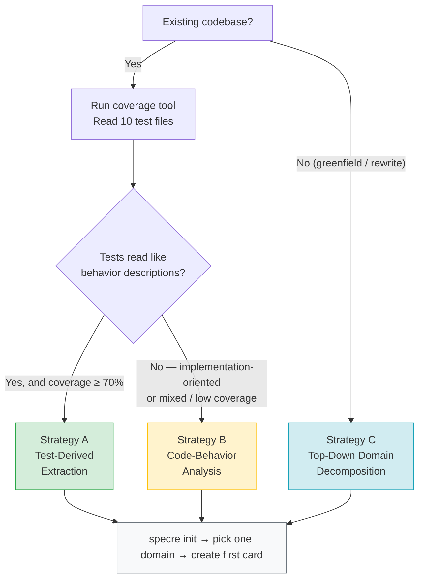

# Adoption Strategy Guide

Guidance for engineers retrofitting specre into an existing codebase. If you are starting a greenfield project, the path is simpler: create specre cards as you develop using the [sdd-new workflow](../../.claude/commands/sdd-new.md). This guide addresses the harder problem — introducing specre into a living codebase with accumulated code, tests, and implicit design decisions.

## Quick Decision Chart



| Strategy | When to use | Starting point |
|----------|-------------|----------------|
| [**Strategy A**: Test-Derived Extraction](#strategy-a-test-derived-extraction) | High coverage + behavior-oriented tests | Your test suite |
| [**Strategy B**: Code-Behavior Analysis](#strategy-b-code-behavior-analysis) | Low coverage, implementation-oriented, or mixed tests | The source code |
| [**Strategy C**: Top-Down Domain Decomposition](#strategy-c-top-down-domain-decomposition) | Greenfield, major rewrite, or untangleable codebase | Domain knowledge |

> **Not sure?** Jump to [Choosing Your Entry Point](#choosing-your-entry-point) at the bottom.

---

## Phase 0: Assess Your Test Landscape

Before choosing a strategy, evaluate two orthogonal dimensions of your test suite. These determine which artifacts you can trust as the starting point for specification extraction.

### Dimension 1: Coverage Breadth

What percentage of your codebase has automated tests? Run your coverage tool (`coverage`, `simplecov`, `istanbul`, `tarpaulin`, etc.) and note the number. This tells you how much of the codebase has *any* test-level observation, regardless of quality.

### Dimension 2: Test Intention

This is the more important axis. Sample 10-20 test files across different modules and classify each:

**Behavior-oriented tests** verify *user-observable outcomes*:

- Test names describe what the system does from an external perspective: `"user can reset password"`, `"system rejects expired token"`
- Setup establishes a scenario; assertions check outcomes and side effects
- Each test block maps to roughly one observable behavior
- Changing internal implementation without changing behavior should not break these tests

**Implementation-oriented tests** verify *internal mechanics*:

- Test names mirror method signatures: `test_calculate_total`, `test_validate_email_format`
- Assertions check return values of specific methods or internal state
- Refactoring (without changing behavior) frequently breaks these tests
- Tightly coupled to class/module structure

Most real codebases are mixed. What matters is the *dominant pattern* per domain.

### Assessment Matrix

| Coverage | Dominant Test Intention | Recommended Strategy |
|----------|------------------------|---------------------|
| High (≥70%) | Behavior-oriented | **Strategy A**: Test-Derived Extraction |
| Any | Implementation-oriented or mixed | **Strategy B**: Code-Behavior Analysis |
| N/A | New development / re-architecture | **Strategy C**: Top-Down Domain Decomposition |

> The coverage threshold (70%) is a heuristic, not a hard boundary. A project with 60% coverage but consistently behavior-oriented tests may be better suited for Strategy A than a project with 90% coverage of method-level unit tests. Let the test intention dimension take precedence when the two axes conflict.

---

## Strategy A: Test-Derived Extraction

**Premise**: Your tests already encode behavioral knowledge. specre cards are a reformulation of what your test suite already knows — from executable assertions into human- and agent-readable specifications.

**Applicable when**: Tests are behavior-oriented with sufficient coverage. The test structure (describe/context/it blocks, or equivalent) reflects how users and stakeholders think about the system.

### A-1. Pilot Domain Selection

Do not start with the entire codebase. Choose ONE domain that satisfies:

- Highest test *quality* (not necessarily highest coverage)
- 5-15 test files with well-structured describe/context blocks
- Active development (specre provides immediate ROI for code being changed)

### A-2. Test Structure Analysis

For each test file in the pilot domain, identify behavior boundaries:

| Test Structure Pattern | Likely specre Mapping |
|------------------------|----------------------|
| Top-level `describe` with multiple `context`/`describe` blocks, each testing distinct outcomes | Multiple specre cards (one per `context` cluster) |
| Single `describe` with one coherent scenario (setup → action → assertion) | One specre card |
| Integration test spanning multiple modules | May need decomposition into separate specre cards per behavior |
| Parameterized/table-driven tests varying input for the same behavior | One specre card with multiple scenarios |

Produce a mapping document: test file + block → proposed specre card name.

### A-3. Card Creation

```bash
# Scope source-dirs to the pilot domain — not the entire codebase.
# Coverage is calculated as: tagged files / all files in source-dirs.
# If source-dirs covers the whole tree, a single-domain pilot will
# show near-zero coverage and health-check will fail immediately.
specre init --specre-dir docs/specres --source-dirs src/billing,tests/billing

# For each identified behavior:
specre new docs/specres/billing --name <behavior_name>
```

For each card:

- **Related Files**: List both source files and test files
- **Scenarios**: Translate test cases into natural language. Do *not* copy test code — describe the behavior as a sequence of preconditions, actions, and expected outcomes
- **Status**: Set to `draft` — not `stable`, regardless of test pass rate

### A-4. Validation

This step is non-negotiable, even when deriving from well-written tests.

Tests verify *current behavior*. A specre card should describe *intended behavior*. These may differ:

- A test might assert behavior that was a bug but never got caught
- A test might not cover an important edge case that stakeholders expect
- The test's implicit assumptions may not be the actual design intent

Have a domain expert review each `draft` card. The review question is: **"Is this what the system *should* do, or merely what it *currently* does?"**

After validation:

```bash
# Tag source and test files
specre tag <ULID> <source_file>
specre tag <ULID> <test_file>

# Promote to stable
# (Edit the card: status → "stable", last_verified → today's date)
```

### A-5. Incremental Expansion

```bash
# Measure pilot domain coverage
specre coverage

# Check for orphaned cards or markers
specre orphans

# Set health-check thresholds in specre.toml and verify
specre health-check
```

When adding a new domain, **widen `source_dirs` in `specre.toml`** to include it:

```toml
# specre.toml — after adding the second domain
source_dirs = ["src/billing", "tests/billing", "src/auth", "tests/auth"]
```

Coverage is always calculated against the full `source_dirs`. Expanding the scope before the new domain has cards will temporarily lower your coverage ratio — add the directory *as you begin* card creation for that domain, not before.

Repeat A-1 through A-4 for the next domain. Resist the urge to parallelize across many domains simultaneously — quality degrades when review bandwidth is spread thin.

### A-Risks

| Risk | Mitigation |
|------|------------|
| Assuming test structure = behavior structure without analysis | Perform A-2 explicitly; do not mechanically create one card per test file |
| Translating test implementation into scenarios (pseudocode instead of natural language) | Scenarios describe *what happens*, not *how the code does it* |
| Missing untested behaviors | Cross-reference with code to identify behavioral gaps after card creation |
| Bulk generation by AI agent without review | Limit batch size to one domain; require human review between batches |

---

## Strategy B: Code-Behavior Analysis

**Premise**: Tests are insufficient as a source of behavioral knowledge — either too sparse, too implementation-focused, or too inconsistently organized. The code itself is the most reliable (though imperfect) source of what the system does.

**Applicable when**: Test coverage is low, tests are implementation-oriented, or the test suite is a mixture of styles that resists systematic extraction.

### B-1. Scope Definition

Choose a bounded context with clear boundaries. Prioritize domains that are:

- **Under active development**: Highest immediate ROI — specre cards guide ongoing work
- **About to be refactored**: specre captures the "before" state, making refactoring safer
- **Frequently causing bugs**: Specification gaps are likely the root cause of recurring defects

Explicit constraint: Do NOT attempt more than one domain at a time in the initial adoption phase.

```bash
# Scope source-dirs to the chosen domain.
specre init --specre-dir docs/specres --source-dirs src/orders,tests/orders
```

### B-2. Behavior Discovery

Read the code in the chosen domain. For each module, class, or function cluster, ask:

- **What does this guarantee to its callers?** (public API contract)
- **What state transitions does it manage?** (lifecycle, status changes)
- **What side effects does it produce?** (DB writes, events emitted, external API calls, notifications)
- **What does it reject, and how?** (validation rules, error responses, invariant enforcement)

Each answer that describes a distinct, user-observable outcome becomes a candidate specre card.

Express each as a specre name with a clear subject and predicate:

- `system_rejects_expired_token` (not `token_validation`)
- `order_total_includes_tax_and_discount` (not `calculate_total`)
- `user_receives_confirmation_email_after_purchase` (not `send_email`)

### B-3. Card Creation with Epistemic Honesty

```bash
specre new docs/specres/<domain> --name <behavior_name>
```

Critical difference from Strategy A: you are *inferring* intent from implementation. Be explicit about this uncertainty:

- **Status**: Always `draft`
- **Functional Overview**: Note the derivation: *"Derived from code analysis. Requires validation against original design intent."*
- **Scenarios**: Describe observed behavior. Flag ambiguity explicitly — *"Current code allows negative quantities — is this intentional?"*
- **Design Intent**: Leave blank or write *"To be confirmed"* — do not fabricate rationale

### B-4. Stakeholder Validation

This step is even more critical in Strategy B than in Strategy A. When deriving specs from code, the risk of codifying bugs as specifications is substantial.

The validation question: **"Is this what we *want* the system to do?"**

Possible outcomes per card:

| Validation Result | Action |
|-------------------|--------|
| Confirmed as intended | Promote to `in-development` → write/find tests → `stable` |
| Identified as a bug | Keep as `draft`, file a bug, update the specre to describe the *intended* behavior |
| Ambiguous — no one is sure | Keep as `draft`, flag for further investigation |

### B-5. Test Gap Analysis

For each validated specre card:

1. Check if adequate tests exist for the described scenarios
2. Use `specre orphans` to identify unlinked cards
3. Write missing tests based on specre Scenarios (the specre card now drives test creation — this is where SDD begins to provide compound returns)
4. Tag source and test files with `specre tag`

### B-Risks

| Risk | Mitigation |
|------|------------|
| Documenting bugs as specifications | Mandatory stakeholder validation (B-4) before any card reaches `stable` |
| Analysis paralysis on large codebases | Strict scoping (B-1); one domain at a time |
| Specre cards describing "what the code does" instead of "what it should do" | Epistemic honesty in B-3; validation in B-4 |
| Inferring too-fine granularity (one specre per method) | Focus on caller-visible guarantees, not internal decomposition |

---

## Strategy C: Top-Down Domain Decomposition

**Premise**: Neither code nor tests are reliable sources of behavioral specification. You are defining behaviors from domain knowledge — what the system *should* do — then mapping those definitions to existing or new code.

**Applicable when**: Greenfield development, major re-architecture, or the existing codebase is too tangled to derive trustworthy specifications from.

### C-1. Domain Mapping

```bash
# For greenfield: source-dirs can be the full src tree since all code is new.
# For re-architecture of a subsystem: scope to the target directories.
specre init --specre-dir docs/specres --source-dirs src --ext rs,ts        # greenfield
specre init --specre-dir docs/specres --source-dirs src/billing --ext rs   # re-arch of one domain
```

Define top-level domains as directories under `docs/specres/`. Domains should reflect **business/functional boundaries**, not code structure:

```
docs/specres/
  auth/           # Authentication & authorization
  billing/        # Payment processing, invoicing
  notifications/  # Email, push, in-app notifications
  inventory/      # Stock management, availability
```

NOT:

```
docs/specres/
  controllers/    # ← mirrors code structure, not behavior
  models/
  services/
```

### C-2. Behavior Enumeration

For each domain, enumerate user-observable behaviors by asking:

- What can a user **do** in this domain? → `user_can_*` specres
- What does the system **enforce**? → `system_rejects_*`, `system_validates_*` specres
- What does the system **produce** as a side effect? → `system_sends_*`, `system_emits_*` specres
- What **invariants** must always hold? → `*_never_*`, `*_always_*` specres

Each answer becomes a `draft` specre card:

```bash
specre new docs/specres/<domain> --name <behavior_name>
```

At this stage, Scenarios can be skeletal — the goal is to enumerate, not to fully specify.

### C-3. Prioritized Implementation

Not all `draft` cards need immediate implementation. Triage:

| Card Type | Action |
|-----------|--------|
| Corresponds to existing, working code | Validate → link → tag → promote to `stable` |
| Requires new code | Implement via [sdd-new workflow](../../.claude/commands/sdd-new.md) (test-first) |
| Aspirational / future requirement | Keep as `draft`; treat as a backlog |

### C-4. Continuous Health Monitoring

Configure thresholds in `specre.toml`:

```toml
[health_check]
coverage = 0.30       # Start low, increase as adoption progresses
orphans = 10          # Tolerate some initially
index_age_hours = 24
```

Integrate into CI:

```bash
specre health-check
# Exit code 0 = healthy, 1 = unhealthy
```

Ratchet thresholds upward as the ecosystem matures.

### C-Risks

| Risk | Mitigation |
|------|------------|
| Over-specification before understanding the implementation space | Start with skeletal Scenarios; flesh out during implementation |
| Specre backlog debt (cards that never get implemented) | Regular triage; deprecate cards that lose relevance |
| Domain decomposition that doesn't match natural code boundaries | Accept that domain ≠ code structure; Related Files can span directories |

---

## Common Anti-Patterns

### The Documentation Project

Treating specre adoption as a documentation sprint — attempting to specify the entire codebase before resuming normal development. specre cards should be created *alongside* active development, not as a separate phase.

**Symptom**: Dozens of `draft` cards with no `stable` cards after weeks of effort.

### Premature `stable`

Marking cards as `stable` without genuine stakeholder validation. A `draft` card is honest; a false `stable` erodes trust in the entire ecosystem. The `health-check` and `status` commands are only useful if `stable` carries real meaning.

**Symptom**: High specre coverage but recurring "the code doesn't match the spec" surprises.

### Granularity Mismatch

Creating specre cards that are too coarse (`"user authentication"` — too many behaviors in one card) or too fine (`"password field accepts unicode"` — an implementation detail, not a behavior).

**Heuristic**: One specre card should have 2-5 scenarios. Fewer suggests the card is a fragment of a larger behavior; more suggests it conflates multiple behaviors.

### Agent Bulk Generation Without Review

Using an AI agent to generate all specre cards in a single pass. Even with excellent tests, agent-generated cards require human review to ensure:

- Consistent granularity across cards
- Accurate representation of design intent (not just observed behavior)
- Absence of hallucinated or inferred requirements

**Recommendation**: Generate one domain at a time. Review and stabilize before proceeding to the next.

---

## Measuring Adoption Progress

specre provides built-in metrics to track adoption:

```bash
# Percentage of source files linked to specre cards
specre coverage

# Unlinked specre cards or orphaned markers
specre orphans

# Aggregate ecosystem health (single boolean verdict)
specre health-check
```

### Suggested Milestones

| Phase | Target | Verification |
|-------|--------|--------------|
| Pilot (Week 1-2) | One domain fully specified | `specre coverage` for pilot domain files ≥ 80% |
| Expansion (Month 1) | 2-3 active domains covered | `specre health-check` passes with moderate thresholds |
| Integration (Quarter 1) | All actively-developed domains | `specre health-check` in CI; thresholds at production levels |

The goal is not 100% coverage of the entire codebase. Dormant code, vendored dependencies, and generated files do not need specre cards. The goal is: **every behavior under active development or modification has a specre card**.

---

## Choosing Your Entry Point

If you are unsure which strategy to start with:

1. Run your test coverage tool
2. Read 10 test files from the domain you care most about
3. If the tests read like behavior descriptions → **Strategy A**
4. If the tests read like method exercises → **Strategy B**
5. If you are about to rewrite this domain → **Strategy C**

Then: `specre init`, pick one domain, and create your first card.
